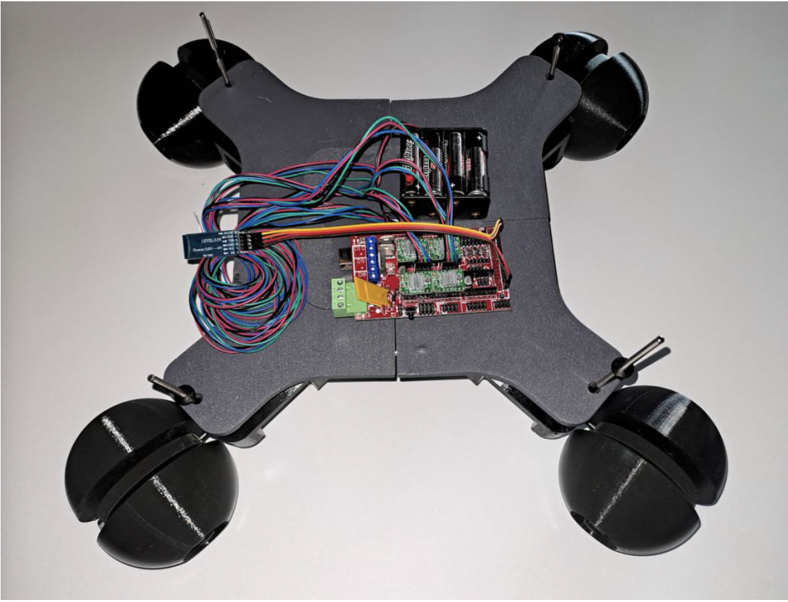
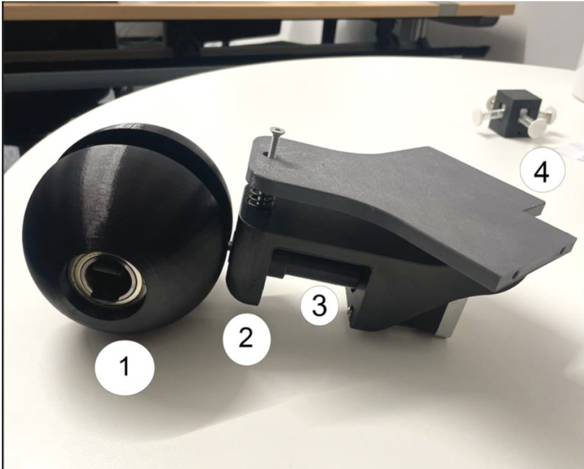
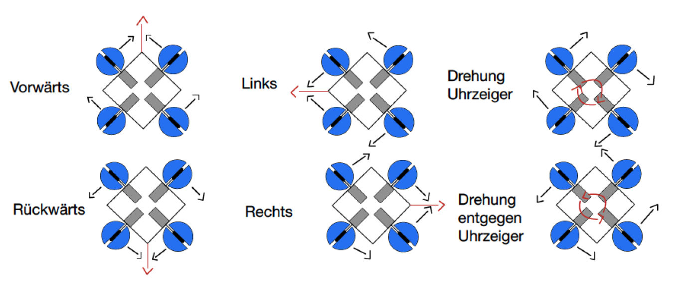
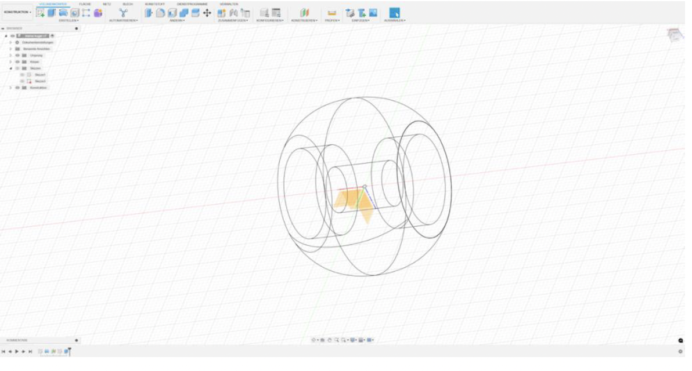
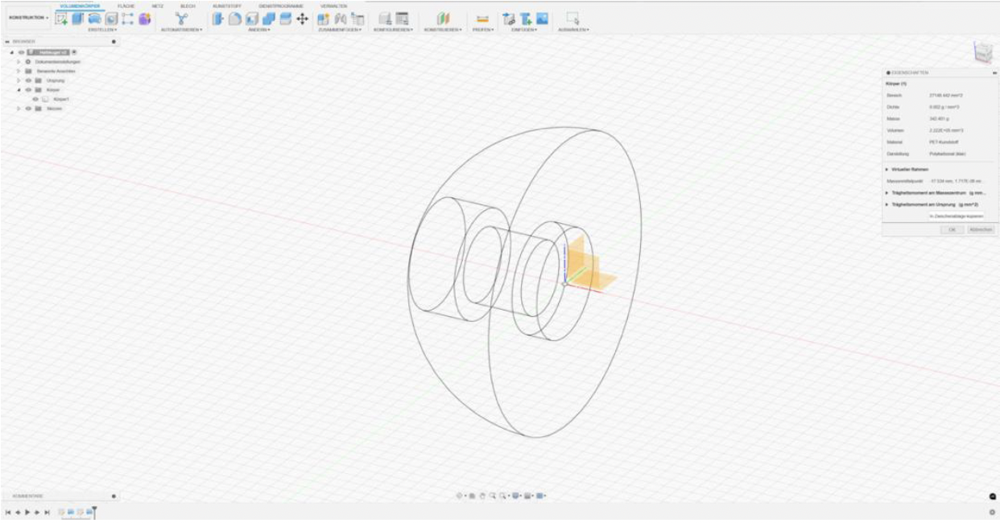
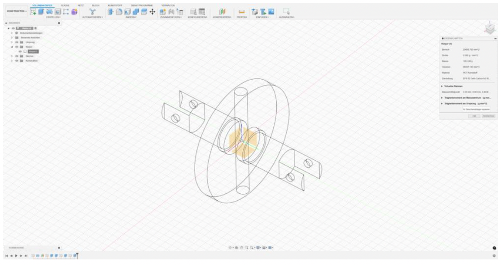
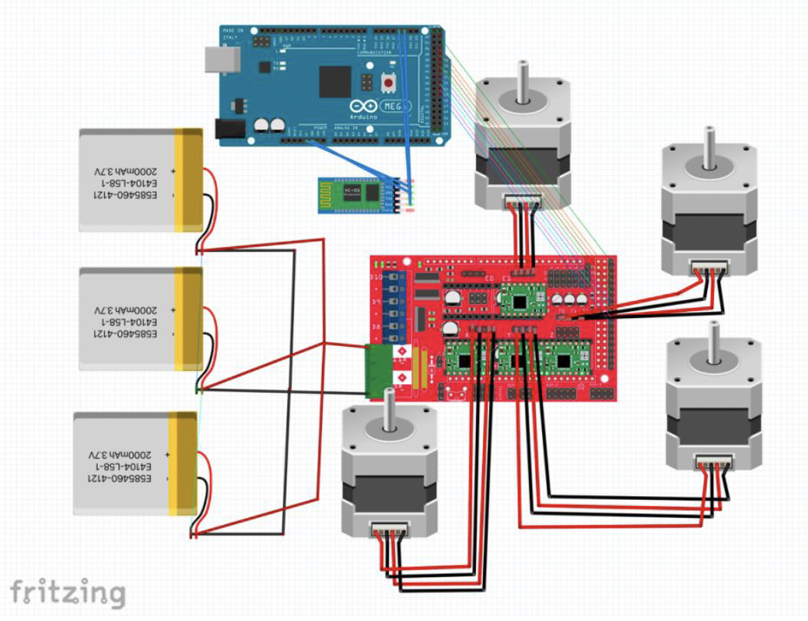

# **Omni-Roboter: Entwicklung eines Prototypen mit Omni-Ball-Antrieb**

## 🎯 **Projektbeschreibung**
Dieses Projekt beinhaltet die Entwicklung eines Prototyp-Roboters mit omnidirektionalem Antrieb. Der Roboter nutzt die **Omni-Ball-Technologie**, die Bewegungen in alle Richtungen ermöglicht. Das Projekt kombiniert **CAD-Konstruktion**, **3D-Druck** und **Arduino-Programmierung**, um einen funktionsfähigen Prototypen zu erstellen, der für Anwendungen in der Robotik und Automatisierung geeignet ist.

---

## 🚀 **Hauptfunktionen**
- **Omnidirektionale Bewegung:** Nahtlose Steuerung in alle Richtungen dank Omni-Ball-Technologie.
- **CAD-Konstruktion:** Präzises Design und Simulation mit Autodesk Fusion 360.
- **3D-Druck:** Mechanische Komponenten wurden aus PETG gefertigt, um eine robuste und leichte Struktur zu gewährleisten.
- **Arduino-Steuerung:** Programmierung der Motoren und Steuerlogik mit der Arduino-IDE.
- **Bluetooth-Integration:** Fernsteuerung des Roboters über ein Bluetooth-Modul.

---

## 🛠️ **Technische Details**

### **Hardware**
- **Arduino Mega 2560**
- **NEMA-17 Schrittmotoren**
- **Omni-Ball-Räder**
- **HC-05 Bluetooth-Modul**
- **LiPo-Akku**
- **RAMPS 1.4 Shield Board**

### **Software**
- **Autodesk Fusion 360:** Konstruktion der mechanischen Bauteile.
- **Arduino IDE:** Steuerung und Bewegungslogik.
- 
---

## 📸 **Bilder**

### **1. Omni-Fahrzeug**

### **2. Halterung**

### **3. Bewegungs-Verhalten**

### **4. Mechanische Details**
- **Kleine Kugel:**
  

- **Hauptkugel:**
  
  
- **Welle:**
  

### **5. Verkabelung**

---

